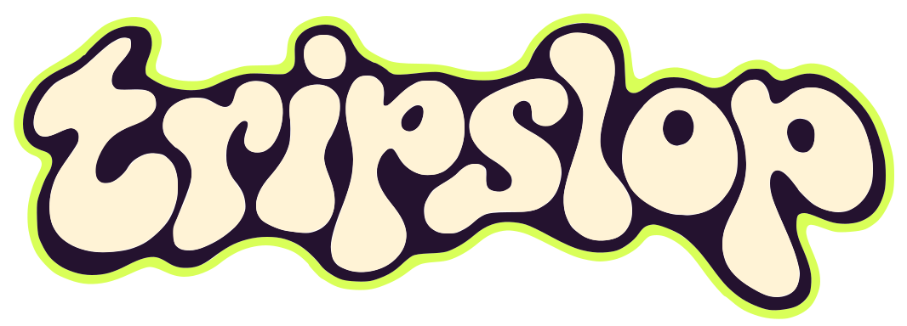
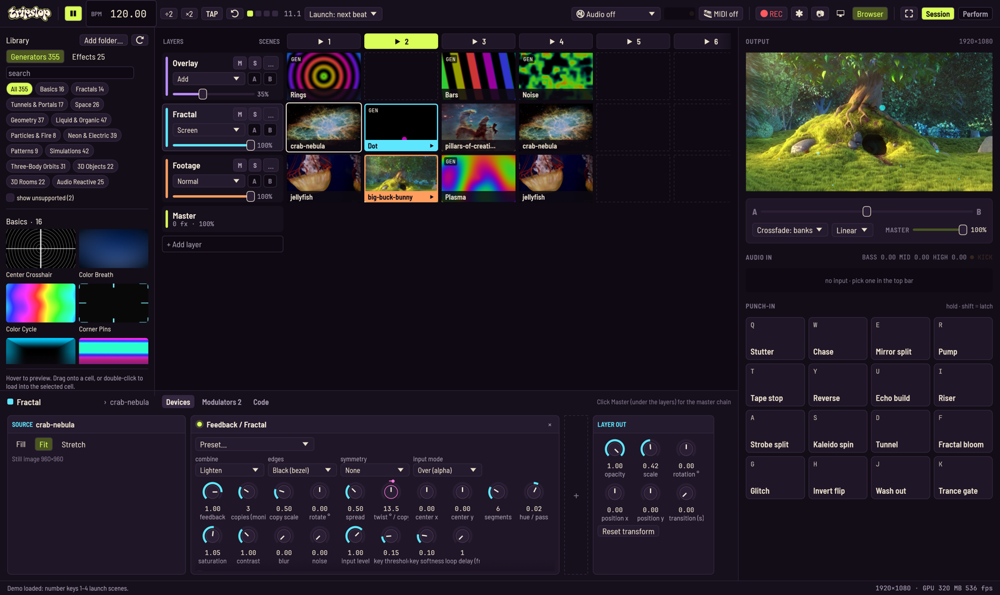

<h1 align="center">
  
</h1>



A live video mixer (VJ tool) in Rust, in the spirit of Resolume Avenue: a clip grid of layers
× scenes, per-layer and master effect chains, blend modes, an A/B crossfader, clip loop modes,
beat-synced automation for every parameter, and recording. Its signature effect emulates an
analog **video-feedback fractal rig** (a camera pointed at monitors, with delay lines, keyers
and proc amps) on the GPU.

```
cargo run --release -- --demo
```

Requires `ffmpeg` and `ffprobe` on your PATH for video, cameras and recording. Images and
generators work without them.

## Demo

`--demo` builds a seven-layer set from the media in `samples/` (run `samples/fetch.sh` to
re-download it). **Run it from the repo root**, since the sample paths are relative.

* **Footage** (bottom): jellyfish, Big Buck Bunny, a plasma generator, and a half-speed
  bouncing jellyfish
* **Fractal**: small images and a dot generator (the layer is scaled to 42%) going through the
  Feedback effect's *Sierpinski* preset, Screen-blended
* **Overlay**: generators through a kaleidoscope, Add-blended at 35%
* **Logo layers**, one per scene, each with its own VHS / public-access treatment (the logos
  are rasterized from `logos/` at load time):
  1. **Tracking**: the wordmark through echo trails, RGB time split and a jumpy wave warp
  2. **Dub**: the flower in a zooming, hue-drifting feedback tunnel, posterized
  3. **Wallpaper**: a scrolling, hue-cycling tile of wordmarks with a stuttering echo
  4. **Station bug**: a small breathing flower in the corner, like a channel watermark

The master chain adds a little line jitter (Wave warp) and a CRT for the tape-on-a-TV look.

Press `1`–`4` to launch scenes. Launches are quantized to the next beat.

Any file arguments are loaded into the first layer's cells: `cargo run --release -- a.mp4 b.png`.

**Output size.** The program renders at 1280×720 by default. Pick 1080p, 1440p or a custom
size on the *Output* card of the master chain (click **Master** under the layers), or start with `--size 1920x1080` (also
`720p`, `1080p`). Odd sizes are rounded down to even numbers. Changing the size rebuilds every
render target, so it clears feedback history and stops a recording. The same card shows a
rough GPU memory estimate.

Sample credits: *Jellyfish* test clip via test-videos.co.uk (footage from jell.yfish.us);
*Big Buck Bunny* © Blender Foundation, CC BY 3.0; *Pillars of Creation* (2014) and *Crab Nebula*
from NASA/ESA Hubble via Wikimedia Commons. See the source pages for the exact terms.
`beat.wav` (a 120 BPM drum loop for the audio test) is generated, not recorded.

## In the browser

tripslop also builds to WebAssembly, so people can try it before downloading. It runs the
demo set on WebGPU (a recent Chrome, Edge, Safari or Firefox).

```
rustup target add wasm32-unknown-unknown
cargo install wasm-bindgen-cli --version 0.2.129   # must match wasm-bindgen in Cargo.lock
web/build.sh                                       # writes the static site to web/dist
python3 -m http.server -d web/dist 8080
```

`web/dist` is plain static files, so any web host can serve it. The browser build leaves out
what needs the operating system:
* video files, cameras and recording (these use ffmpeg)
* audio input, MIDI, snapshots and file dialogs

Generators, the shader and model libraries, every effect, the shader editor, automation and
Perform all work. Images, shaders and self-contained 3D models (not `.gltf` with external
files) can be dropped onto the grid. The demo's video layer uses the stills and generators.

## Concepts

**The window.** Like Ableton's Session view with Bitwig's device panel:
* the transport along the top
* the shader browser on the left (`B` toggles it)
* the clip launcher in the middle
* the **device panel** along the bottom: the selected layer's chain, left to right
* a right rail with everything you touch while playing: the output monitor, the crossfader
  and master, the audio input and the punch pads
* a status bar (messages, output size, GPU memory, fps)

**Perform** (top right, or `Tab`) swaps the editing panels for a big output, a strip per
layer, large scene buttons and pads. Each layer has a color that follows it everywhere.

**Grid.** Rows are layers (the top row is drawn on top) and columns are scenes.
* Click a cell to launch its clip.
* Click a ▶ column header (or press its number key) to launch a whole scene, like an Ableton
  scene. Layers with an empty cell in that scene stop.
* *Launch: next beat / next bar* quantizes launches; pending ones blink amber.
* Drop files onto a cell (several files fill the cells that follow it), or right-click a cell
  to load a file, a generator or a camera.

**Layers.** The header of each row carries the layer's mute (M), solo (S), blend mode, A/B
side and opacity; its … menu stops or removes the layer and picks its color. Each layer has opacity, a blend mode (Normal, Add, Screen, Multiply, Difference,
Lighten, Darken, Overlay, Subtract), an A/B crossfader assignment, bypass/solo, a transform
(position, scale, rotation) and a clip transition time (a crossfade when switching clips).
It also has its own effect chain. Drag or scroll on the output monitor to move or scale the
selected layer.

**Device panel.** Click a layer header (or a clip) to show its chain as cards:
* **Source**: the selected clip (or the playing one): transport, loop mode, BPM sync, speed,
  generator or shader controls, and fit.
* Its effects.
* **Layer out**: opacity, transform and transition time.

Click **Master** (under the layers) for the master chain instead: Output, master effects and
Master out. Parameters are knobs: drag up and down (Shift = fine), scroll to nudge,
double-click to reset, right-click to automate, learn MIDI or reset. Choices are dropdowns.
Double-click a card's header to fold it; ◀ ▶ reorder, × removes, and the dashed **+** adds an
effect. The panel's other tabs are **Modulators** (every automated parameter) and **Code**
(the shader editor).

**Crossfader.** Assign layers to side A or B (or leave them unassigned). The menu under the
fader in the right rail picks how it mixes:
* **Banks** (the default): A layers and B layers are composited into two separate pictures,
  and the fader dissolves between them. Unassigned layers are part of both pictures, in their
  usual place in the stack. The curve is *Linear*, *Smooth* (eases in and out of the ends)
  or *Cut* (switches at the middle). A layer on the side that's faded out keeps running, so
  its feedback is still there when you fade back.
* **Layer opacity**: the fader scales the opacity of A and B layers in place. Both sides are at
  full opacity in the middle, so an opaque layer on top hides the other side until the fader
  passes the middle.

**Clips.**
* Loop modes: **Loop**, **Bounce**, **Random** (jumps somewhere new every beat), **Play
  once** (then the layer goes empty) and **Play once & hold**.
* Direction: forward, reverse or paused, with scrubbing.
* Speed, or **BPM sync**, which stretches the clip to N beats.
* Fit modes: Fill, Fit or Stretch.

On import, each video is transcoded once into in-memory JPEG frames at 1280×720, whatever the
output size (the same idea as Resolume's DXV codec). That gives instant random access for bounce, reverse and random
playback. It takes about 100–150 KB per frame, so a 10 s clip at 30 fps is roughly 40 MB of RAM.

**Generators.** Bars, rings, plasma, checker, an orbiting dot, noise and solid color. Each
has frequency, speed and hue controls.

**Effects** (per layer, plus a master chain on the Composition tab):

| Category | Effects |
| --- | --- |
| Feedback | **Feedback / Fractal**: N scaled, rotated copies of the delayed output with a keyer, hue drift and symmetry. It has presets: Tunnel, Sierpinski, Mandala, Slow trails, Spiral galaxy, Hall of mirrors, Melt |
| Time | Echo trails, RGB time split |
| Space | Kaleidoscope, Mirror, Transform (zoom/rotate/tile), Wave warp, **Shape projector** (the layer mapped onto a spinning 3D prism, pyramid or diamond with 3–12 sides, or any **3D model**; size, height, rotation and beat-synced spin on each axis, per-face or wrapped mapping, lighting), **Projection mapping** (a projector throws the layer at a spinning prism, pyramid, diamond, sphere or **3D model** seen from another angle, so the image bends across the faces; projector angle, elevation and zoom, plus an optional back wall that catches the rest of the image along with the object's shadow) |
| Color | Color (hue/sat/contrast/brightness/gamma/invert), Luma key, Pixelate / posterize |
| Stylize | Blur, Edges, CRT, Strobe (beat-synced) |

**Dry/wet.** Every effect card ends with a **wet** knob and a **wet blend** dropdown. Wet sets
how much of the effect's output replaces its input. With *Normal* it dissolves between the two;
the other blend modes (the layer ones: Add, Screen, Multiply…) lay the effect's output over its
input at the wet amount, so Edges or Blur in *Add* makes a glow. Below 1 the effect still runs,
and feedback and delays keep recording their full output, so a feedback loop at wet 0.3 builds the
same trails, just fainter. Both are ordinary parameters (`2/fx1/wet`, `2/fx1/wet blend`) that you
can automate and MIDI-learn.

Effects can be reordered, bypassed and removed. Effects that need history (feedback and the
delays) each allocate their own 32-frame delay buffer when you add them. That's about 112 MB
at 720p and 253 MB at 1080p each. Tick *Half-size history* on such an effect to keep its
history at half the output size: a quarter of the memory, and feedback rarely looks different.

Tip: the feedback rig's fractals need a seed that doesn't cover the whole frame. Scale the
layer down or use a generator. With a full-frame opaque clip, the input simply covers the loop.

**Custom shaders (live coding).** Paste a Shadertoy shader, or write your own, and it
compiles as you type, like KodeLife. Add one from a grid cell's right-click menu
(*Shader (GLSL)*), or as an effect (*+ Add effect → Custom shader*). You can also drop a
`.glsl` / `.frag` / `.fs` / `.wgsl` file onto a cell.
* **Shadertoy compatible** (single pass): `mainImage`, `iTime`, `iTimeDelta`, `iFrame`,
  `iResolution`, `iMouse` (Alt-drag on the output monitor), `iDate`, `iChannelResolution`.
  GLSL Sandbox style (`void main` + `gl_FragColor`, `time`, `resolution`, `mouse`,
  `backbuffer`) works too.
* **ISF** (the VDMX `.fs` format) works too. It's detected by its `/*{ JSON }*/` header.
  * `INPUTS` become controls:
    * `float` → a knob
    * `bool` / `event` → a toggle
    * `long` → a dropdown of its `LABELS`
    * `point2D` → x/y knobs
    * `color` → r/g/b/a knobs
  * Built-ins: `TIME`, `TIMEDELTA`, `RENDERSIZE`, `FRAMEINDEX`, `DATE`, `isf_FragNormCoord`,
    and the `IMG_NORM_PIXEL` / `IMG_PIXEL` / `IMG_THIS_PIXEL` / `IMG_SIZE` macros.
  * The first `image` input (e.g. `inputImage`) is the layer input.
  * A single `PERSISTENT` pass target is the shader's own previous frame. Multi-pass ISF isn't
    supported yet.
  * A companion `Name.vs` vertex shader next to `Name.fs` is picked up automatically. It runs
    per pixel, which matches the usual use (neighbouring-texel coordinates and the like); ones
    that move vertices (`gl_Position`) don't work.
  * Code written for other hosts mostly works as is: re-declared built-ins (`uniform float
    TIME;`) are ignored, and `centroid` / `patch` / `sample` are fine as names. The audio names
    some hosts add are fed from the audio input: `audioLevel`, `audioBass`, `audioMid`,
    `audioHigh`, `audioSpectralCentroid`, `audioBeat` (the kick envelope, or a pulse on every
    beat of the tempo clock when there's no input), `audioBeatPhase`, `audioBPM`,
    `sampleFFT(u)` and `sampleWaveform(u)`. `audio` / `audioFFT` image inputs get the
    waveform / spectrum.
* **WGSL** also works. It's detected by `@fragment`, and your own entry point is used. It runs
  in screen space (y down). It can use:
  * `inputs.size` (`vec3f`), `inputs.time`, `inputs.mouse`, `inputs.date`, `inputs.frame`,
    `inputs.time_delta`, `inputs.beat`, `inputs.bpm`
  * `inputs.audio` (`vec4f`: level, bass, mid, high), `inputs.kick`, `inputs.audio_on`,
    `inputs.centroid`, and the `audio_fft` / `audio_wave` textures (see **Sound**)
  * `iChannel0`–`3` with the sampler `samp`
  * knobs declared as `// @param speed 0 4 1` and read as `inputs.speed`

  `src/shaders/marble.wgsl` pastes in unchanged, or run `cargo run --release -- src/shaders/marble.wgsl`.
* **Channels**:
  * `iChannel0`: the layer's input (when the shader is an effect)
  * `iChannel1`: the shader's own previous frame (feedback)
  * `iChannel2`: an RGBA noise texture
  * `iChannel3`: last frame's composition output
* **Controls from code**: `uniform float amount; // min max default` (or `int`) becomes a
  knob you can automate like any other.
* **Tempo**: `iBeat` and `iBpm` expose the tempo clock.
* **Sound**: `iAudio` (`vec4`: level, bass, mid, high, each 0..1) and `iKick` (0..1) follow
  the audio input (see **Sound** below).
* **Errors** appear with their line numbers (marked red in the gutter), and the last working
  version keeps running until you fix them. A bad shader can't crash the app, because the
  code is compiled and validated by naga before it reaches the GPU.
* **Alpha**: *Opaque*, *Luminance* (black becomes transparent) or *Shader alpha*.
* The editor lives in the device panel's **Code** tab (*{ } Edit code* on a shader opens it),
  so the monitor stays in view. It has templates, Load/Save of `.glsl` files, and
  Cmd/Ctrl+Enter to compile immediately.
* **Limits**: no Shadertoy multipass buffers (A–D), audio, video or cubemap inputs, and
  samplers can't be passed into functions. naga is also stricter than WebGL; for example,
  write `ivec2(p) % ivec2(4)`, not `ivec2(p) % 4`.

**Library.** The browser on the left (*Browser* in the top bar, or `B`) browses the shaders that come with
tripslop: about 355 generators and 25 effects, baked into the binary from
[`assets/isf`](assets/isf/README.md), so it works the same on every platform without looking
anywhere on disk. They're shown as picture cards, split into **Generators** and **Effects** and
filed into categories (Fractals, Tunnels & Portals, Three-Body Orbits, 3D Rooms, Simulations…).
Click a category chip to show just that one. Search matches names, categories, descriptions and
tags.
* Hover a card to see it move. Effects are shown processing a sample photo.
* Drag a generator onto a grid cell, or double-click it to load into the selected cell (or the
  layer's first free one).
* Drag an effect onto a layer (its header or any of its cells), or double-click it to add it to
  the selected layer, or onto the master chain when **Master** is selected (or drop it on the
  Master row).
* Shaders start with tuned settings where the library has them.
* *Add folder…* (or `--isf DIR`, repeatable) also lists your own `.fs` files, filed by their
  `CATEGORIES`. Nothing outside the bundle is read unless you add it.
* Ones tripslop can't run yet (multi-pass) are hidden; *show unsupported* lists them struck
  through, with the reason on hover. Transitions aren't supported yet.
* The bundled shaders' pictures and compile results are made ahead of time by
  `cargo run --release -- --bake-library` and built into the binary, so the library costs
  nothing at startup. Only folder shaders (and bundled ones edited since the last bake) are
  compiled in the background and drawn live.
* To add a shader to the bundle, drop it in `assets/isf`, give it a name and category in
  `assets/isf/library.json`, and re-bake. `cargo test` checks that the bake is current.
* `cargo test --release isf_report -- --ignored --nocapture` prints a compatibility report for
  the bundle (plus a folder in `TRIPSLOP_ISF`, if set).

**3D models.** The library's **Models** tab has classic test models (the Utah teapot, the
Stanford bunny, dragon, armadillo and Happy Buddha, Suzanne), textured characters (Spot the
cow, Bob, Blub, a glTF fox), and shapes generated from maths (torus knots, a Klein bottle, a
Möbius strip, a seashell, the Platonic solids, a Menger sponge…). Your own files load too:
**OBJ** (with its `.mtl` colours and diffuse texture), **STL** (binary or ASCII; read as
z-up), **PLY** (ASCII or binary, with vertex colours and texture coordinates), **glTF 2.0**
(`.gltf` or `.glb`, with node transforms, vertex colours and the base colour texture; the rest
pose of animated models) and **OFF**. Drop a model file on a cell, pick one with *Load file…*,
use *Add models…* in the Models tab (they're listed under *My Models*), or *Add folder…*
(its model files are listed too, filed by subfolder).
* **As a clip**: drag a model onto a cell (or double-click it). Its Source card has a model
  picker and the controls: material (*Surface*: the model's texture or colours, clay when it
  has neither; *Normals*; *Chrome*; *Toon*; *Hologram* and *Wireframe*, which glow
  additively), hue, size, rotation and beat-synced spin on each axis, position, field of view,
  lighting, a wireframe overlay, flat shading, and three deformers: *explode* (triangles fly
  apart along their normals), *twist* and *wobble*. All of them can be automated.
* **In the Shape projector and Projection mapping**: set *shape* to *Model*, then pick the
  model on the card (or drag one from the browser onto the card). Until you pick one it's the
  teapot. The Shape projector's *model mapping* decides how the layer wraps onto the model:
  *Auto* (the model's own texture coordinates when it has them, else *Box*), *Model UVs*,
  *Cylinder*, *Sphere*, *Box* (triplanar) or *Front* (a decal through the model). Projection
  mapping casts real shadows (a shadow map from the projector), on the model itself and on the
  wall.
* Models are drawn with 4× multisampling. A model is centred and scaled to fit, so size 1
  always fills about the same space. Files over 1.5 million triangles are refused; simplify
  them first. Large files load when you drop them, which can take a moment.
* The bundled models and their licences are listed in
  [`assets/models/README.md`](assets/models/README.md). The Stanford scans can be
  redistributed freely with credit, but not used commercially without Stanford's permission.

**Automation.** Right-click any knob → *Automate…* to attach a signal generator:
* Shapes: sine, triangle, saw up/down, square, sample & hold, smooth random drift, a
  hand-drawn envelope, or **Audio**, which follows a band of the audio input (level, bass,
  mid, high or kick) instead of a cycle.
* Rate: synced to the BPM or free-running in Hz.
* Depth, polarity and phase.

An automated knob shows its sweep as a pink outer arc with a dot at the live value. The
**Modulators** tab of the device panel lists everything that's automated, with a live plot
of each signal; click a name to jump to its device.

**Sound.** Pick an input in the top bar's audio menu: the default input, a specific device,
or a WAV file. To react to what the computer itself is playing, use a loopback device such as
BlackHole. Each tick, tripslop analyses the latest ~40 ms into:
* `level`: overall loudness
* `bass` (20–150 Hz), `mid` (150 Hz–2 kHz) and `high` (2–12 kHz)
* `kick`: jumps to 1 on a bass hit and fades over ~150 ms
* the spectral centroid (brightness), a 512-band spectrum (log frequency, 30 Hz → 16 kHz) and
  the latest 512 samples, for shaders

Every value has auto-gain, so it uses the whole 0..1 range at any input volume, and fast
attack / slower release smoothing. Silence reads as 0. The meter next to the menu shows level,
bass, mid and high, with a light for the kick. Use them with the **Audio** automation shape,
in your own shaders (`iAudio`, `iKick`), and in the library's **Audio Reactive** shaders.
A WAV file is read in step with tripslop's clock rather than played out loud, which keeps
scripts deterministic.

## Recording

Press `Cmd/Ctrl+R` (or **⏺ Record**) to start and stop. Frames are captured straight from the
renderer, so the file has no UI in it. It's saved as `tripslop-<timestamp>.mp4` (H.264,
at the output size, 60 fps) in the directory you launched from, using the hardware encoder on macOS and
x264 elsewhere. The file is finalized even if you quit mid-recording. `--record` starts
recording at launch. There's no audio.

Recording never slows down the live output. If the GPU readback or the encoder falls behind,
the frame is dropped and the previous one is repeated in its place, so the file keeps its
real-time length. The record button shows how many frames were dropped. Scripts (fixed-step
mode) record every tick instead, waiting for the encoder if they have to.

## Punch-in FX

Inspired by the OP-Z / KO II punch-in effects: **hold** a pad for a momentary, beat-synced
transformation, and release to snap back. Hold several at once to stack them, or
**Shift+key / Shift+click** to latch a pad for hands-free builds. Pads ease in and out, and
know how long they've been held, so builds intensify the longer you hold.

Punches aren't just master effects. Each one is a small routine that can:
* inject temporary effects into individual layers (alternating layers, the top layer, a
  random layer each beat…)
* gate or pump layers in beat-locked patterns
* take over clip playback

They never modify your set: release a pad and everything is exactly as it was.

| Key | Pad | What it does |
| --- | --- | --- |
| Q | Stutter | Beat repeat on every clip: 1/2 beat, then 1/4, then 1/8 the longer you hold |
| W | Chase | One layer visible at a time, stepping through the layers on 1/16s |
| E | Mirror split | Alternate layers mirror sideways / vertically; the top layer turns kaleidoscope |
| R | Pump | Each layer zoom-pumps on the beat, phase-shifted per layer |
| T | Tape stop | Clips grind to a halt over a beat while the picture sags and drains |
| Y | Reverse | Clips play backwards with an RGB time split and a hue flip |
| U | Echo build | 1/16-note echo trails that thicken while held |
| I | Riser | Two-bar build: zoom, blur and brightness climb; an accelerating strobe kicks in |
| A | Strobe split | Even layers on the beat, odd layers on the off-beat |
| S | Kaleido spin | Master kaleidoscope spinning with the beat |
| D | Tunnel | Master feedback tunnel, turning the other way every bar |
| F | Fractal bloom | The top layer blooms into a Sierpinski fractal; the others dim |
| G | Glitch | Random per-layer jumps, a random layer pixelates, CRT master |
| H | Invert flip | Layers invert in alternation, flipping every beat |
| J | Wash out | Whiteout transition over a bar |
| K | Trance gate | Master chopped by a 16-step gate |

## MIDI

The **🎹 MIDI** menu in the top bar picks the input: all devices (the default), one device, or
off. *Rescan devices* picks up a controller plugged in later.
* **Pads:** notes 36–51 (the usual drum-pad layout) play the 16 punch pads, in Q…K order.
  Note on holds a pad, note off releases it.
* **MIDI learn:** right-click any knob, punch pad or scene button → *Learn MIDI*, then move
  a knob or hit a pad. A CC sweeps a knob across its range (following log knobs and
  snapping choices); a note sets it to the top while held. Mapped knobs show a small **M**;
  the same menu shows the mapping and offers *Forget MIDI*. Learned mappings win over the
  default pad notes, and each control drives one thing.
* **Shift:** learn a button as *Shift* (in the MIDI menu); hold it and hit a pad to latch or
  unlatch the pad, like Shift on the keyboard.
* **MIDI clock:** with *Follow MIDI clock* on, the incoming clock sets the BPM, each quarter note
  keeps the beat in phase, and Start lines the beat up with a downbeat.
* The menu lists every mapping (× to forget one) and the last message received.

Mappings belong to the controller rather than the set, so they're saved in `midi.json` in
tripslop's config directory (`~/Library/Application Support/tripslop` on macOS,
`~/.config/tripslop` on Linux, `%APPDATA%\tripslop` on Windows, or `TRIPSLOP_CONFIG_DIR`).
Parameters are saved by their path (`2/fx1/rotate °`: layer 2, its first effect), so a mapping
follows the layer and effect position, not their names. Scripts leave the hardware and the
saved mappings alone unless `TRIPSLOP_CONFIG_DIR` is set.

## Controls

| Key | Action |
| --- | --- |
| Q–I, A–K | punch-in FX (hold; Shift = latch) |
| 1–9 | launch scene (column) |
| Space | play / pause all clips |
| Enter | tap tempo |
| Tab | Session / Perform view |
| B | show / hide the browser |
| ← / → | crossfader |
| Cmd/Ctrl+R | start / stop recording |
| Cmd/Ctrl+S | save a PNG snapshot |
| Cmd/Ctrl+K | clear all feedback / delay memory |
| Cmd/Ctrl+F, Esc | performance mode (fullscreen output only) |
| Delete | remove the selected clip |
| drag / scroll on output | move / scale the selected layer |

**Output window** opens a second window you can drag to a projector and double-click to make
fullscreen.

## Scripts and testing

`--script FILE` runs timed commands against the real app. Use it for automated tests and CI,
for capturing stills, or to set up a performance.

```
cargo run --release -- --script scripts/smoke.tripslop
```

Scripts run in **fixed-step** mode: the 60 Hz clock advances by simulated ticks rather than
wall time. That makes results independent of machine speed, and runs finish faster than real
time. `--realtime` turns this off and `--fixed-step` forces it on without a script.

The process exits with status **1** if an `assert` fails or a command errors. A bad script
exits with **2** before opening a window.

```text
# comments start with #
demo                          # runs at time 0
at 1.25b launch-scene 2       # times: frames (default), Ns seconds, Nb beats
at +4b   hold Q 4b            # +N = relative to the line above; hold = pad down, up 4 beats later
set Fractal/feedback/rotate 15
assert active 1 == 2
at 600   snapshot target/script-out/end.png
screenshot target/script-out/ui.png
quit
```

Layers and columns are **1-based**, like the UI.

| Command | |
| --- | --- |
| `demo` | load the demo set |
| `launch-scene N` · `launch L C` · `stop L` | launch a scene / a clip; stop a layer |
| `load L C PATH` · `generator L C NAME` · `shader L C TEMPLATE` · `isf L C NAME` · `model L C NAME` · `camera L C INDEX` | put media in a cell (layers are created as needed); `isf` takes a library generator's name, `model` a library model's (`load` also takes model files) |
| `effect-model LAYER/EFFECT NAME` | give a Shape projector or Projection mapping a library model (and set its shape to *Model*) |
| `add-effect L NAME` · `add-effect master NAME` | add an effect by name; `shader:TEMPLATE` adds a code effect, `isf:NAME` a library effect, `file:PATH` a shader file (e.g. an ISF `.fs`) |
| `library generators/effects/models [CATEGORY]` | show the library browser on that view (for screenshots) |
| `set PATH VALUE` | set a parameter (see paths below) |
| `bpm N` · `quantize off/beat/bar` · `play` · `pause` | transport |
| `crossfade bank/layer [linear/smooth/cut]` · `side L a/b/off` | crossfader mode and curve; a layer's side |
| `size WxH` (or `720p`, `1080p`) · `history LAYER/EFFECT full/half` | output size; an effect's history size |
| `pad KEY down/up/latch/unlatch` · `hold KEY DURATION` | punch-in pads, by key, name or number |
| `select L C` · `tab layer/master` · `tab devices/modulators/code` · `tab session/perform` · `open-editor L C` | UI state, for screenshots |
| `snapshot PATH` · `screenshot PATH` · `record start/stop` | output frame, full window, video |
| `audio FILE.wav` · `audio off` | analyse a WAV file in step with the clock (deterministic) |
| `automate PATH SHAPE [DEPTH] [BEATS]` · `automate PATH off` | attach automation: `sine`, `square`, `drift`, … or `audio:BAND` (e.g. `audio:kick`) |
| `midi note N on [VEL] [CH]` · `midi note N off [CH]` · `midi cc N VALUE [CH]` | fake MIDI input (channels 1–16, default 1); goes through the same mappings as hardware |
| `midi learn PATH` · `midi learn pad KEY` · `midi learn scene N` · `midi learn shift` | start MIDI learn; the next note or CC is mapped |
| `midi follow on/off` · `midi clock BPM` | follow MIDI clock; send Start and two beats of clock |
| `print WHAT` · `assert WHAT OP VALUE` · `quit` | checks; `OP` is one of `== != < <= > >= ~=` |

**`WHAT`** is either a parameter path or one of: `playhead L`, `active L` (1-based column, 0
for none), `pad KEY` (envelope 0..1), `errors L C` (shader compile errors), `triangles L C`
(a model clip's triangle count), `layers`, `bpm`,
`beat`, `width`, `height`, `audio BAND` (`level`, `bass`, `mid`, `high` or `kick`), or
`output X Y` (the luma, 0..1, of the program output at a point; 0..1 from the top left).

**Parameter paths** have one of these forms:
* `LAYER/PARAM`, `LAYER/EFFECT/PARAM`, `LAYER/clip/PARAM` (the playing clip) or
  `LAYER/clipN/PARAM`
* `master/master`, `master/crossfader` or `master/EFFECT/PARAM`

`LAYER` is a number or a name. Effects can also be given as `fxN`. Names match
case-insensitively by prefix, so `2/feedback/rot` works. Paths can contain spaces without quotes (`set 1/shape/spin y 0.5`).

**Tests:**
* `cargo test` runs the unit tests (no window).
* `cargo test --release -- --ignored` also runs the scripts in `scripts/` (smoke, shaders,
  punch tour, shape, projection, crossfade, resolution, library, audio, midi) as end-to-end tests. These need a GPU and a window session. Captures go to
  `target/script-out/`.

For a quick single still, use `TRIPSLOP_SNAPSHOT=<frames>:<out.png>`. It saves the output after
that many frames and quits.

## How it works

```
for each layer (bottom → top):
    clip(s) ── clip pass: transform, fit, transition ──► layer texture
    layer   ── effect → effect → … (each with an optional history ring) ──►
    layer   ── composite: blend mode × opacity ──► bank A and/or bank B
crossfade(bank A, bank B) ── master effects ──► final (master fader) ──► screen / output window / recorder
```

Everything runs on a fixed 60 Hz clock, so effects, delays and BPM sync behave the same on
any display. Shaders are validated by `cargo test`.
